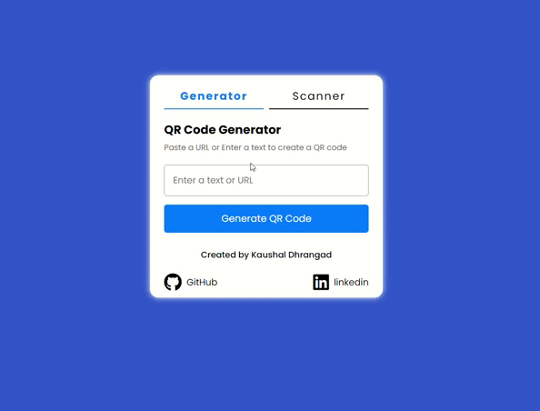

# RSA_Secure_QR_Generator_Scanner

RSA_Secure_QR_Generator_Scanner is a web-based application that combines QR code generation and scanning capabilities with RSA encryption for enhanced security. This project allows users to create QR codes containing encrypted data and scan QR codes to securely retrieve and decrypt their contents.

## Table of Contents
- [Introduction](#Introduction)
- [Features](#Features)
- [Why RSA](#WhyRSA?)
- [Technologies Used](#TechnologiesUsed)
- [Installation](#Installation)
- [Usage](#Usage)

## Introduction
The RSA-Secure-QR-Generator-Scanner application combines the convenience of QR codes with the security of RSA encryption. Users can securely encode text, URLs, or other data into QR codes, ensuring that the content is encrypted. Additionally, users can scan and decrypt QR codes to retrieve the secure information.

This project is ideal for applications requiring secure data transmission via QR codes, such as secure information sharing, payment systems, and confidential messaging.

## Features
#### QR Code Generator:

Generate QR codes from any text, URL, or data input.Automatically encrypts the input using RSA encryption before generating the QR code.

#### QR Code Scanner:

Scan QR codes using the camera or upload QR code images.
Decrypt the content of the QR code securely using RSA decryption.

#### RSA Encryption:
RSA algorithm ensures that the data encoded in the QR codes is secure and can only be decrypted by authorized recipients.

#### User-Friendly Interface:

Seamless navigation between the QR code generator and scanner features.
Responsive design for ease of use across different devices.

## Why RSA?

The RSA algorithm is a widely-used asymmetric encryption method that offers a high level of security. It involves a pair of public and private keys—data encrypted with the public key can only be decrypted with the corresponding private key. By using RSA encryption, this project ensures that the information embedded in the QR code is protected from unauthorized access, making it ideal for use cases where confidentiality is crucial.

## Technologies Used

#### Frontend:

HTML5, CSS3, and JavaScript for creating the user interface and interaction.

#### Libraries & Tools:
Font Awesome for icons.
jsQR for QR code scanning functionality.
Forge.js for implementing RSA encryption and decryption.

#### Security:
RSA Encryption and Decryption using Forge.js.

## Installation

This project is open-source and available under the [MIT License](https://github.com/kaushaldhrangad/qr-code-generator/blob/master/LICENSE).

 ## Usage 

#### Generate QR Code:

Enter a URL, text, or any data in the input box in the generator section.
Click on "Generate" to create a QR code that contains the encrypted data.
Optionally, download the QR code by clicking the "Download" button.

#### Scan QR Code:

Use the file upload or camera feature to scan a QR code.
The encrypted data will be decrypted and displayed in the text area.

##
Feel free to reach out with any issues or suggestions. Happy coding! 🚀

